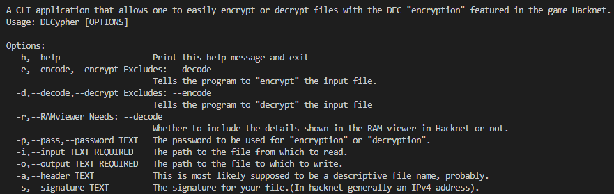

# What is this?

This repo aims at providing a library and example command line application for encrypting a file using the DEC encryption featured in the hacking simulator game Hacknet.

Note that this repo turned into an exercise in properly learning CMake, and proper project structuring at some point, I don't know when or how that happened, but it did happen, so enjoy, I guess? ¯\\\_(ツ)_/¯

# Can I use this?

Sure you can, but is that a good idea? Don't worry, I'll answer the question for you, it is **not** a good idea as the algorithm is very weak.(Sorry Matt!)

# Tell me more!

Oh okay. Usage for DECypher can be obtained by calling `./DECypher -h`, `./DECypher --help`, or `.\DECypher /h`(all are equivalent). The output should look something like

Documentation for declib can be found under docs/declib in Markdown format.

# What is and where can I get Hacknet?

Hacknet is a fun hacking simulator, I recommend it. It has a nice extension(custom campaigns) community and a good DLC.

You can get it on the [Steam store](https://store.steampowered.com/app/365450/Hacknet), [GoG](https://www.gog.com/game/hacknet), the [Humble Store](https://www.gog.com/game/hacknet), the [Discord store](https://discordapp.com/store/skus/449639683740270612/hacknet) and [Origin](https://www.origin.com/irl/en-us/store/hacknet/hacknet). Its official website can be found at [hacknet-os.com](http://hacknet-os.com).

# Legal

This project is licensed under the MIT License, the license file can be found [here](LICENSE).

CLI11 is licensed under 3-clause BSD, text can be found [here](thirdparty/CLI11/CLI11_LICENSE)(the license is included verbatim).

I do not own Hacknet.
